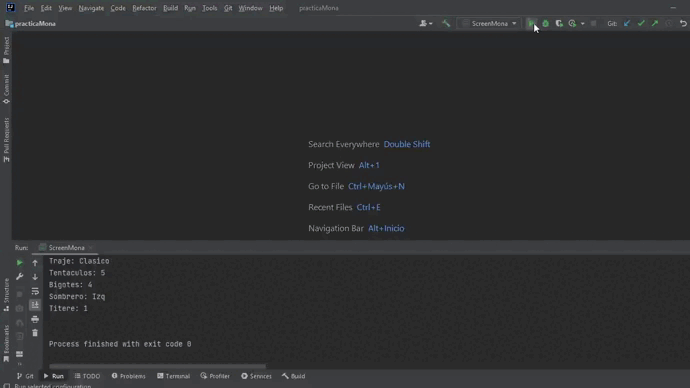
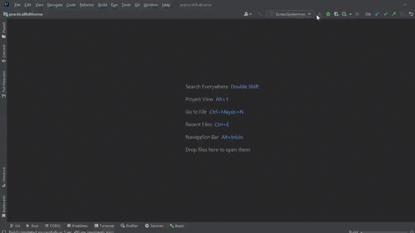

# Backend-Java
## Descripción
Es el portafolio de prácticas realizadas en el segmento de Backend de Launch X. Dentro de cada carpeta, puede encontrar más información acerca de la practica.

## Visuales
### Práctica Harry

  

### Práctica Mona

  

### Práctica Multiverse

  

